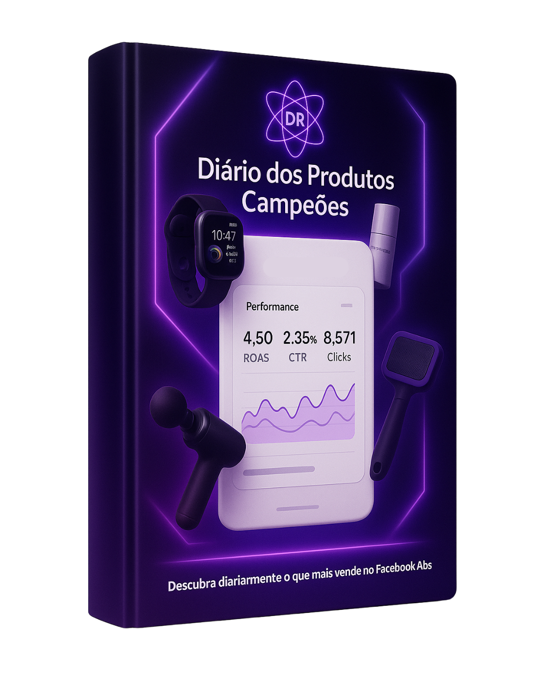

<h1> 📘 Diário dos Produtos Campeões — eBook Project </h1>

  This repository contains the full project of the <strong>"Champions’ Products Daily"</strong> eBook — a digital guide created for affiliates and digital marketers who want to stay updated on the top-selling products on Facebook Ads every single day.

<h2>🎯 Purpose</h2>

The goal of this project is to deliver a professional and visually appealing material that:

<ul>
  <li>Showcases daily best-selling products.</li>
  <li>Serves as a reference for affiliates, media buyers, and content creators.</li>
  <li>Offers high-converting ad copy for free to boost campaign performance.</li>
</ul>

<h2>📦 Repository Contents</h2>
<ul>
  <li><code>.docx</code> file (Word format) for easy editing.</li>
  <li>Final <code>.pdf</code> version ready for distribution.</li>
  <li>Original cover artwork and 3D mockup variations.</li>
  <li>Main copy designed for Facebook Ads.</li>
  <li>Visual assets and design references used in the project.</li>
</ul>

<h2>🧠 Target Audience</h2>
<ul>
  <li>Beginner and advanced affiliates</li>
  <li>Paid traffic specialists</li>
  <li>Copywriters</li>
  <li>Digital product creators</li>
  <li>Marketing agencies</li>
</ul>

<h2>✨ Highlights</h2>
<ul>
  <li>Modern cover with a digital-futuristic design</li>
  <li>Minimalist style and soft purple color palette</li>
  <li>Simulated performance metrics from Facebook Ads</li>
  <li>Free version includes access to one exclusive ad copy</li>
  <li>Paid version unlocks premium access to multiple high-performing copies</li>
</ul>
